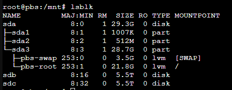

# Introduction
This document is meant to pertain and link to all things related to working with storage devices in Linux. Various links will lead to more detailed instructions, or notes about specific commands.

## lsblk
``lsblk`` is used to list block devices #UsefulCommands

- The name indicates the Device name in this example sda is located in \dev\sda. 
- The first sub devices are the partitions as an example sda1, sda2, sda3 located at \dev\sda1, \dev\sda2, \dev\sda3 
- Subdivided below that on sda3 we have two lvm(s) aka logical volumes. To work with them you'll need the [VGtools Package](Volume%20Group%20Tools.md)
- The MOUNTPOINT indicates the path that particular devices is mounted to.

**Pay attention to the Type heading as this also indicates what these devices are, Devices, Partition, LVM, RAID, etc**

## RAID Groups
If there was a raid involved they would appear with the prefix ``mdm X`` the toolkit for working with RAID is ``mdadm`` . See the notes on [[All Things RAID]] for more information on that toolset.

For working with the partition table, [fdisk](Formating%20Disks.md) is the most common utility for most distros.