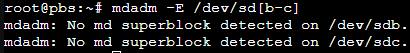
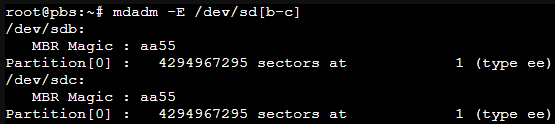
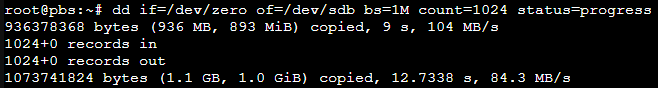
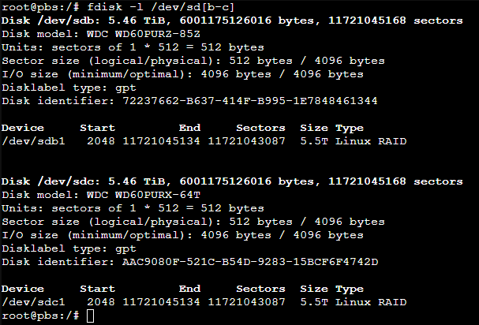

[Back to Index](Index.md)

# RAID Toolkit
## MDADM
MDADM is used for managing MD devices AKA Linux Software RAID. 
Run ``man mdadm`` to bring up the system manual assuming the package is installed. If it is not ``apt-get install mdadm`` will download the appropriate package. More information on Linux RAID can also be found on the [Linux RAID Wiki](https://raid.wiki.kernel.org/index.php/A_guide_to_mdadm#Overview)

This [site](https://www.digitalocean.com/community/tutorials/how-to-manage-raid-arrays-with-mdadm-on-ubuntu-16-04) provides a plethora of information on how to manage arrays with mdadm.

*Refer to the [All Things Drives](All%20Things%20Drives.md) document for more commands for working with storage devices.*

# How to make a Linux RAID

## Prepping the Drives
First step is to make sure that there are no RAIDs previously defined on the disks. Use [lsblk](All%20Things%20Drives.md##lsblk) to find the device ID of the drives we'll be using. For this example sdb and sdc are the drives we're going to be working with. Run ``mdadm -E /dev/sd[bc]`` to verify they are clear.
#### If Drives Are Clear:

This shows there is no RAID data on the drive and your clear to proceed.
#### If Drives Are not Clear:

You can use dd to clean the RAID header data from the MBR. Run `dd if=/dev/zero of=/dev/sdb bs=1M count=1024 status=progress`  #UsefulCommands to write zeros to the hard drive for a total of 1024 Mbytes. This should clear out the MBR where the superblocks from the previous RAID have been stored.

As you can see the zeroing command was only ran for about 10 seconds and now the drive is ready to go.

## Partition the Drives
[fdisk](Formating%20Disks.md) can be used to format the drives under the section on [Partitioning](Formating%20Disks.md##Creating%20Partitions). Create a partition that encompasses the entire drive. [Modify the File System Type](Formating%20Disks.md##Modifying%20File%20System%20Type) to "Linux Raid". Once completed the disks should look like this:

## Creating the Array
This part actually builds the array. this example will create a RAID 1 AKA Mirroring.

`mdadm --create /dev/md0 --level=mirror --raid-devices=2 /dev/sd[b-c]1`

### MDADM Parameters
- ``--create`` specifies the new device label to provide the array. In this scenario /dev/md0
- ``--level`` specifies the type of RAID. In this scenario we're using mirror
- ``--raid-devices`` is the number of disks to use, followed by the device and partition number.
- ``--detail`` prints detailed information about the array.

## Verifying the Array
After successful creation of the array run `cat /proc/mdstat` to verify the status of the array. Alternatively running ``mdadm --detail /dev/md0`` will provide more information about the RAID device.

[Back to Index](Index.md)