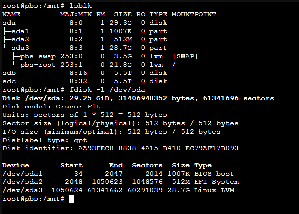
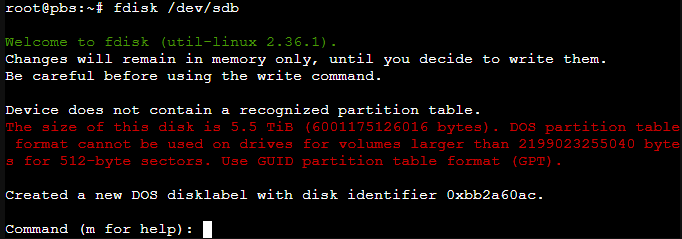
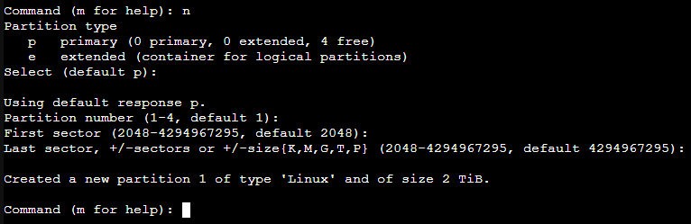
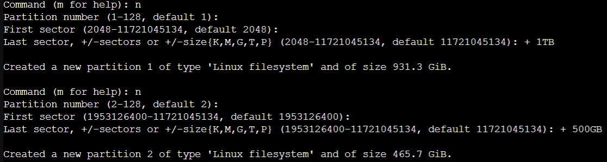
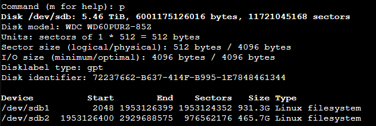
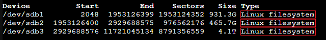
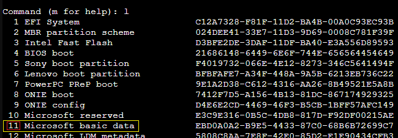
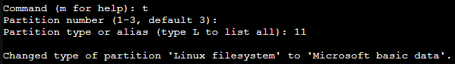
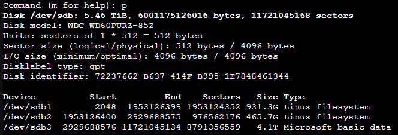
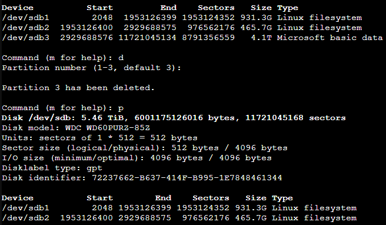

[Back to Index](Index.md)

# What is fdisk?
fdisk stands for Format Disk, it is used to work with the disk partition table. The most useful command to display detailed partition data on a particular devices is ``fdisk -l \dev\<device id>`` #UsefulCommands

Here we see a plethora of useful disk information such as the overall size of the disk, the model, disk label type, the disk identifier or UUID, and most importantly the partitions. The command executed first lsblk as described in [All Things Drives](All%20Things%20Drives.md) allowed us to find the device id so we could list that drives information with fdisk.

# Using fdisk

If you know the device you wish to work with open it by running ``fdisk /dev/<device-id>``. For this rest of this section, we'll be working with sdb.

The welcome message indicates any warnings that maybe associated with the disk. In this case the drive has an unrecognized partition table and it is 5.5TB. It also automatically ran the command to [write an empty MBR](Formating%20Disks.md###Writing%20a%20MBR) so you can start creating new partitions.

The ``m`` key will give you the list of commands, but the most important keys are:
- ``w`` writes all changes to disk and quits.
- ``q`` quits fsdisk without saving changes.

## Creating Partitions
With a blank drive, as shown in the example above, the first thing to do is create a new partition.
- `n` will prompt for a new partition

The partition type, either primary or extended, also shows how many partitions are currently on disk. The number of free is listed as 4 because this drive is currently formatted as an MBR, which can only have a total of 4 primary partitions each with a maximum size of 2TB. 

If your drive is larger than 2TBs as is the case in this example, press `q` to quit without making changes, and proceed to the [GPT](Formating%20Disks.md###Writing%20a%20GPT) section.*

## Sizing a Partition
Once any issues with the Partition Table have been addressed the next option after selecting the partition number is the start sector which defaults at 2048. The Last Sector is the last sector of the partition. This number can be specified with + or - followed by sector number or size. The example below shows a new drive with 2 partitions created. 

Use the `p` command to print the current partition table.

If everything looks good hit `w` to write changes to disk and quit.

*FOOTNOTE:* In this example since the drive is 5.5TBs there is still roughly 4TBs unpartitioned. The first sector always defaults to the next sector after the last partition as seen in the example above. The last sector always defaults to the last sector of the drive. If we created a third partition and didn't specify the last sector it would default to the remaining space and create a partition that is roughly 4Tb.

## Creating a MBR or GPT Partition Table

### Writing a MBR
MBR stands for Master Boot Record. It is the first sector of the computers hard drive that tells the computer how and where to load the operating system.

`o` will write an empty MBR, also known as a DOS partition table, and `w` to save and quit.

### Writing a GPT

GPT stands for GUID Partition Table and its essentially an enhancement of MBR allowing larger partitions and up to 128 of them. See [here] (https://en.wikipedia.org/wiki/GUID_Partition_Table) for more information.

`g` will write an empty GPT partition table and `w` to save and quit.

## Modifying File System Type
When a new partition is created it defaults to Linux file system.

If we were to install Windows on one of these partitions the file system would need to be changed. To do this first type 'l' to list the partition types. The list is in pages so be sure to scroll down to see all the types. As of this writing there were over 100 types in the list. Take note of the command number in red.

Use 't' to change the partition type.

Notice when prompted it defaults to partition 3. Fdisk always selects the last available partition when making modifications.

Use 'p' to print the partition table to confirm the change is correct.

## Deleting a Partition
Use 'd' to delete a partition. The selection just as in modifying types will default to the last partition automatically. Hit enter to confirm an 'p' to verify the change.

*NOTE If there is a volume group on one of the partitions you will need to [Volume Group Tools](Volume%20Group%20Tools.md#vgremove)*

[Back to Index](Index.md)