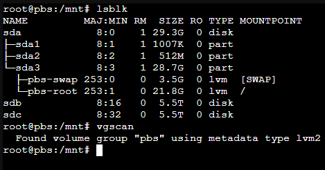

VGtools are used to mount and control logical volumes also known as Volume Groups. To see if any disk or partitions contain LVMs run vgscan.
 #UsefulCommands 

The command first ran before ``vgscan``, [lsblk](All%20Things%20Drives.md##lsblk) ,shows the list of drives and partitions as well as two already mounted LVMs. The ``vgscan`` function found the PBS Volume group.

# vgremove
If you have a drive that contains a partition that also contains a volume group, you wont be able to delete that partition until you remove the volume group. This is where vgremove comes in. First run ``vgscan`` to identify the volume groups. then run ``vgremove <volume group name>`` It will tell you the number of logical volumes within that group and confirm the removal of each one. Once that is done you will be able to delete the partition. 