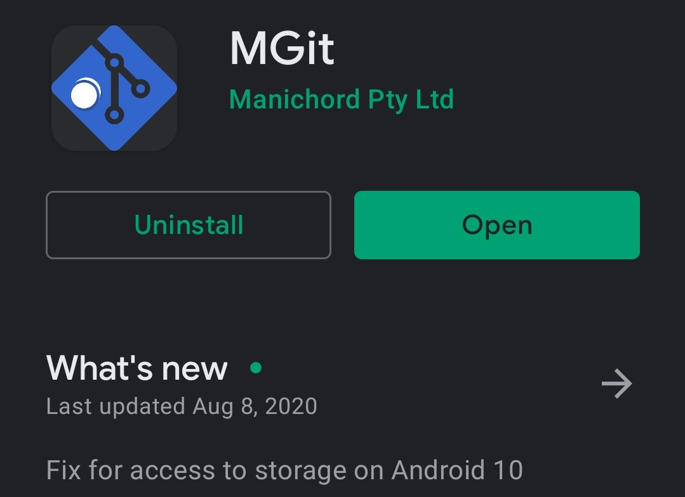
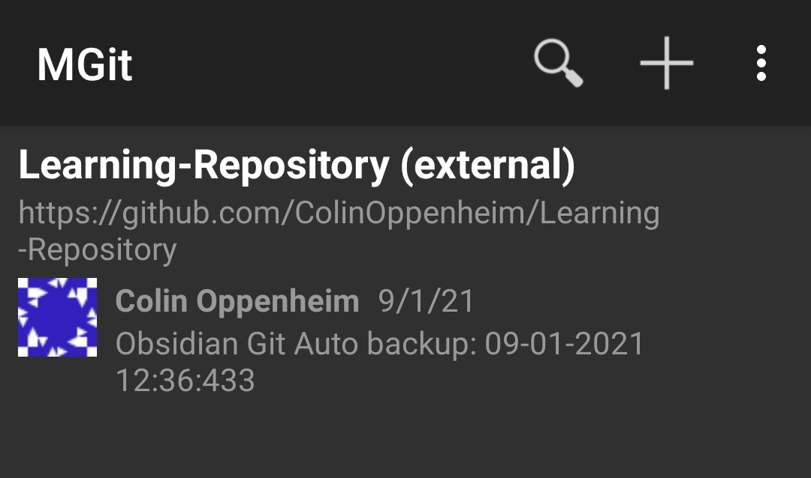

# Welcome to the Learning Repository formally known as RTFM.
_This repo is here to keep all the things and teach all the things because Alfresco, Confluence, and other note taking sites do the opposite of blow._

## Here are a list of Dont's and Do's

### **Don't** -
- _Hoard knowledge, if you kept everything, where would you put all of it?_
- _Commit Binaries to Git, someone will tell you not to break BitBucket after its already been broken._
- _Cache Mimi Cats on Github, someone with an axe to grind will own your machine._
- _Forget to fill out your timecard even if you are salary._
- _Operate in a vacuum, if you need help or are struggling do not hesitate to ask._

### **Do** - 
- _Improve upon the list of Dont's - Growth through pain is inevitable, but it doesn't mean others should have to repeat your mistakes either._
- _Share your knowledge and include hints, easter eggs, trivia, sci-fi references, memes, gifs, obscure pop-culture references that those with a real or imaginary man-bun may not fully understand and other delitful treats to keep our sense of humor well stocked for a looooooooong journey._
- _Use the Cheatsheet provided below for examples on how to make your RTFM documents the best that they can be. Please feel free to add to this document as new more obscure markdown abilities get added to your utility belt, so that you may share your tools with the rest of the class._

## Visit the Markdown Basic Syntax page to learn all about best practices and common tips 


# Mobile Syncing through Git
Go to the Playstore and download mGit:

This application is a very basic mobile git client for Android. Once installed connect it to the remote repo on GitHub, and specify the download location for your phone. Upon initial connection, it will ask you for a username and password; however, this is not your normal login for GitHub. You will need to generate a token on GitHub to use as an application password. Additionally, your username is the username on GitHub **NOT** your email address.

Once your setup with mGit it should look similar to this:


Now download Obsidian from the Google Playstore. Once downloaded, select, "Open Folder as Vault." Select the root folder containing the Git repository. Once you're done, it will automatically import the obsidian data in the vault. You'll be greeted by a notice about unsafe plugins such as Obsidian Git. Doesn't matter if you enable it or not, the plugin is currently not supported on Android, so it will automatically be disabled. So far I haven't noticed any effect upon this on the desktop when I go back to review data that has been synced from the mobile. Additionally when I pull down the git repo, the updated changes instantly appear in the mobile app, so no need to close and reopen.

## Things Learned when writing on mobile.
It basically sucks, but if you _have_ to do it make sure you turn off Toggle Live/Preview Source mode. It will cause _waaaaaay_ more problems than it will solve. Especially if you tried to do any kind of markdown in whatever document you're creating.
## mGit Caveats
- Conflicts are always going to be the number one issue and because mGit is not a full client, you do not have the ability to stash changes, nor a command line interface. Temux could be a possible alternative with the git pkg installed but I'm unsure how to do so on a non-rooted phone.
-  By default it will not add folders and possibly files, upon commit so you will need to click and hold on each file and select "add to stage."

## Obsidian Caveats
- Adding an image from mobile will copy the file into the vault folder automatically. From there it is up to you to move it where you want it to be. Preferably an images folder. The hyperlinking used by Obsidian to reference images isn't the traditional markdown format by default. You have to modify the link to ensure that the file name contains no spaces, and that there is an alternative text option syntax is: 
```
 
```
- Obsidian will recognize either image hyperlinking format but the format above ensures images will show up in Github or any other markdown compliant application.
