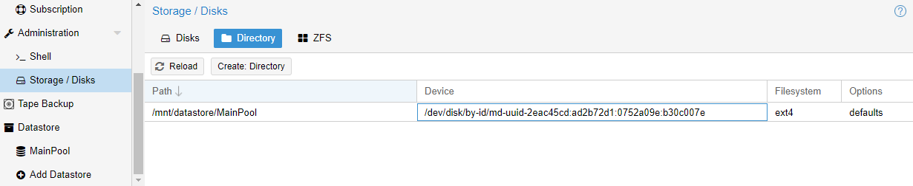
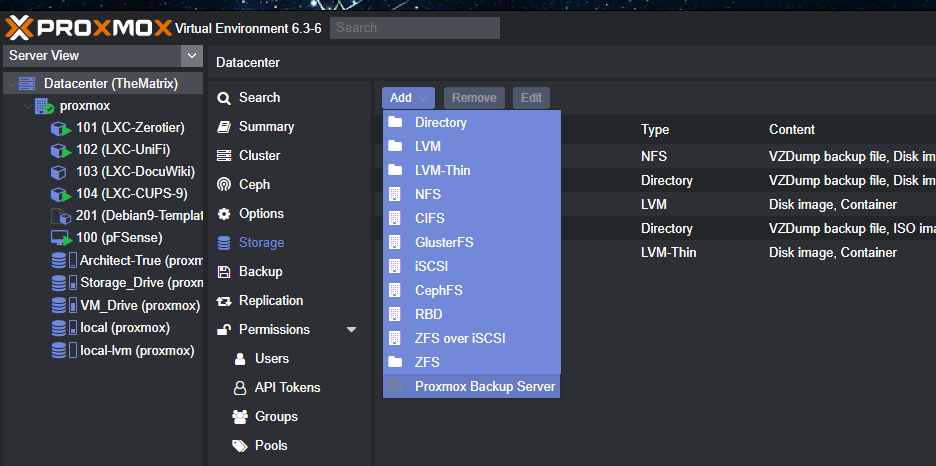
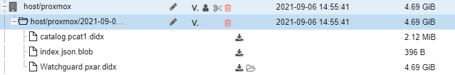
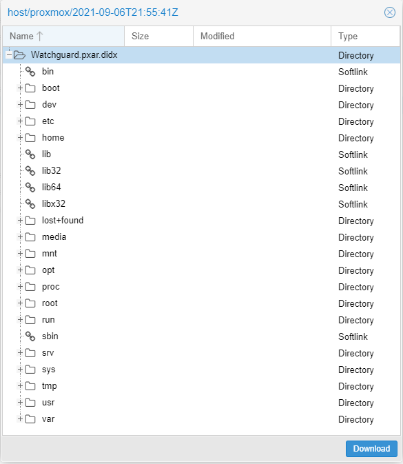

[Back to Index](Index.md)
# Introduction
**UPDATE - 4-18-2022** - _These instructions are based on PBS 2.04. Recently PBS 2.1 has been released for use with Proxmox PVE 7.1. Some of the provided details or caveouts maybe obsolete or need updating. Refer to [Upgrading PBS 2 04 to 2 1](Proxmox%20Customized.md#Upgrading%20PBS%202%2004%20to%202%201) in the Proxmox Customized note for more details._

So now that we have become a heavy Proxmox whore we need a special place to backup all our VMs as I have started to virtualize my entire existence I better get started cause eventually my brain will also be relocated to a VM in the near future. 

# Creating a Datastore
With my installation of Proxmox Backup Server to my old Synlogy DS710+ because Synology end of life'd it, and my inner hoarder just can't throw anything away, so I decided to use it to backup my VMS cause its very low power and something i don't worry about having on all the time. So the big issue i have is currently the only RAID option that Proxmox backup server has is a ZFS raid. Normally i'd be all for it, but the problem is this device does not use ECC memory and ZFS can really put a load on this little Atom processor when its writing files... so i figured yea... ZFS really isn't an option. So we're going to try creating a Linux RAID using [MDADM](All%20Things%20RAID.md##MDADM).

BUT FIRST....

We need to hack our Proxmox backup server a little so we will be able to utilize the datastore for preforming backups. We do this by selecting one of the drives and giving it a name in this case "MainPool" so Proxmox can create the appropriate changes to datastore.cfg and whatever else it does in the background.


Here we see that it has partitioned the sdb drive and mounted it by its UUID to ``/mnt/datastore/MainPool``. We will probably need to modify the mount point UUID somewhere to that of the RAID once its created. Refer to the [Verifying the Array Section](All%20Things%20RAID.md##Verifying%20the%20Array) of the [All Things RAID](All%20Things%20RAID.md) document to retrieve the UUID.

We will need to find the configuration files that are specifying the UUID of sdb so they can be replaced by the md0 UUID.

But Back to the RAID. Once we have [created the array](All%20Things%20RAID.md##Creating%20the%20Array) we'll need to give it a file system. Since we created the original data store as an ext4, we'll do the same using [[mkfs]] to format the Linux RAID. Once complete we can modify the UUID to properly mount our RAID datastore.

We're going to run a recursive grep for that as drive's UUID: 61ba8868-0a78-4e4b-bdcf-77679e9cf868 with ``grep -r "61ba8868-0a78-4e4b-bdcf-77679e9cf868" /``

These are the files found so far:

``/etc/systemd/system/mnt-datastore-MainPool.mount:What=/dev/disk/by-uuid/61ba8868-0a78-4e4b-bdcf-77679e9cf868``

Using [[locate]] to find the file path associated with RAID's UUID, the path is ``/dev/disk/by-id/md-uuid-2eac45cd:ad2b72d1:0752a09e:b30c007e``. After updating the systemd file with [[vim]] we run ``shutdown -r`` to reboot the unit.

After logging back in, we see that the RAID is now in the data store and properly mounted.


```root@pbs:~# lsblk
NAME         MAJ:MIN RM  SIZE RO TYPE  MOUNTPOINT
sda            8:0    1 29.3G  0 disk  
├─sda1         8:1    1 1007K  0 part  
├─sda2         8:2    1  512M  0 part  
└─sda3         8:3    1 28.7G  0 part  
  ├─pbs-swap 253:0    0  3.5G  0 lvm   [SWAP]
  └─pbs-root 253:1    0 21.8G  0 lvm   /
sdb            8:16   0  5.5T  0 disk  
└─sdb1         8:17   0  5.5T  0 part  
  └─md0        9:127  0  5.5T  0 raid1 /mnt/datastore/MainPool
sdc            8:32   0  5.5T  0 disk  
└─sdc1         8:33   0  5.5T  0 part  
  └─md0        9:127  0  5.5T  0 raid1 /mnt/datastore/MainPool
```

The only issue remaining is the missing .chunk data folder. Best solution is to remove and re-add the datastore. Removing it will not remove the mount or directory from datastore.cfg. Run ``proxmox-backup-server remove datastore <datastore name>`` Then run ``proxmox-backup-server create datastore <datastore name> /<path to mountpoint>`` It will start recreating the data chunk store.

# Connecting a PVE AKA Proxmox Hypervisor
Log into the the Proxmox Virtual Environment Server AKA **PVE**, you want to backup. Select Datacenter at the top and click on the Storage heading on the right. Click the ADD button and select Proxmox Backup Server. Enter the appropriate information. 


## User credentials
The configuration requires the user to include a domain name or you can't save. If your going to be using the local root user, the domain is ``pam``. So the user would be entered as  ``root@pam``.

## Retrieving the Backup Server Fingerprint

The Fingerprint is the 256 bit key located on the backup server. Click on Dashboard and in the upper right there is a button marked "Show Fingerprint." Click that and then select the button to copy it to the clipboard.

## Enter the Datastore
Go back to the Proxmox host you are backing up and add that fingerprint to the new Proxmox Backup Server storage configuration. You will also have to manually type in the name of the Datastore where the backups are to be stored on the Backup Server.

# Backing up a VM or CT
#PLACE-HOLDER-FOR-CONTENT 

# Backing up a PVE Host
There is no native GUI tools for backing up a Proxmox host within the Proxmox Virtual Environment or the Proxmox Backup Server. There is however a CLI tool called ``proxmox-backup-client`` It is installed on any PVE that supports Proxmox backup server. This client can also be downloaded to a few Linux distros such as Debian or Ubuntu to back those clients up to the Proxmox backup server as well. Someone even wrote an [Ansible Playbook](https://github.com/djarbz/ansible-proxmox-backup-client) for downloading the Proxmox Backup Client to a Debian based OS. The instructions for the Backup Client are located [here](https://pbs.proxmox.com/docs/backup-client.html#creating-backups).

From the Poxmox host, select the host just below DataCenter, and click ``>_Shell`` button. To do an instant default backup of the host, type:

	``proxmox-backup-client backup <BackupName>.pxar:/ --repository <backup-server IP or DNS>:<Datastore name>``
	
By default Proxmox backup client will skip any mounted drives, run, sys, and other folders not necessary for system backup. An exclude list or include list can be created. Refer to the [PBS manual](https://pbs.proxmox.com/docs/index.html) on using the [Proxmox Backup Client](https://pbs.proxmox.com/docs/backup-client.html#creating-backups) for more information. Here is an example of a default backup.

```
root@proxmox:~# proxmox-backup-client backup Watchguard.pxar:/ --repository pbs.thematrix.lan:MainPool
Password for "root@pam": *******
Starting backup: host/proxmox/2021-09-06T21:55:41Z
Client name: proxmox
Starting backup protocol: Mon Sep  6 14:55:43 2021
fingerprint:  <HIDDEN>
Are you sure you want to continue connecting? (y/n): y
No previous manifest available.
Upload directory '/' to 'pbs.thematrix.lan:MainPool' as Watchguard.pxar.didx
skipping mount point: "dev"
skipping mount point: "etc/pve"
skipping mount point: "mnt/pve/Architect-True"
skipping mount point: "mnt/pve/Storage_Drive"
skipping mount point: "proc"
skipping mount point: "run"
skipping mount point: "sys"
skipping mount point: "var/lib/lxcfs"
Watchguard.pxar: had to backup 4.39 GiB of 4.69 GiB (compressed 2.03 GiB) in 539.19s
Watchguard.pxar: average backup speed: 8.33 MiB/s
Watchguard.pxar: backup was done incrementally, reused 308.18 MiB (6.4%)
Uploaded backup catalog (2.12 MiB)
Duration: 545.63s
End Time: Mon Sep  6 15:04:49 2021
```


Whats really cool about this is expanding upon the backup i can actually click the little folder icon and see everything that was backed up and can download the data if needed!

# Problems Experienced thus far
After letting the RAID sync overnight before ever applying a file system one of the drives failed and would not show any SMART data. I took note of the serial number, controlled shut down the box so I could pull the drive out and take a look. Once i figured out which one was the bad drive, I put it back and restarted the machine. When I got back in Proxmox that drive was now reporting the SMART data on both drives but the sdc had fallen out of the array and the array dev name was changed from /md0 to /md127. I re-added the drive to the array with ``mdadm --manage /dev/md127 --re-add /dev/sdc1`` and it added it back and it automatically started rebuilding.

```
       Update Time : Sun Sep  5 11:14:44 2021
             State : clean, degraded, recovering 
    Active Devices : 1
   Working Devices : 2
    Failed Devices : 0
     Spare Devices : 1

Consistency Policy : bitmap
Rebuild Status : 64% complete

              Name : pbs:0  (local to host pbs)
              UUID : 2eac45cd:ad2b72d1:0752a09e:b30c007e
            Events : 5688

    Number   Major   Minor   RaidDevice State
       0       8       17        0      active sync   /dev/sdb1
       1       8       33        1      spare rebuilding   /dev/sdc1
```

Interestingly enough, even though DEV ID changed the UUID remained the same.

[Back to Index](Index.md)